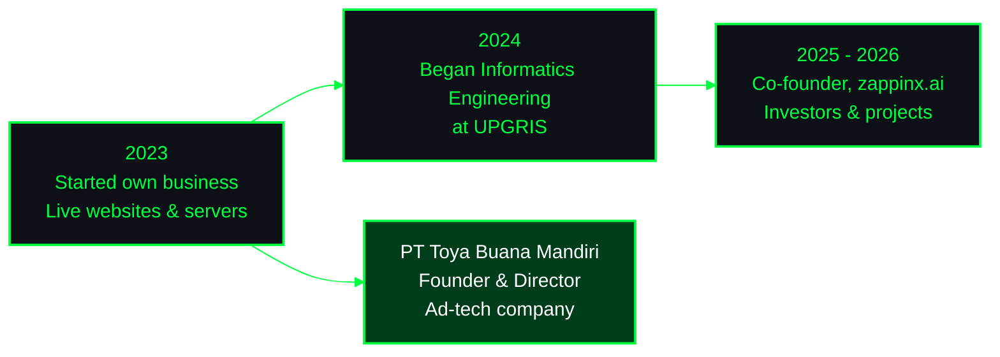

<!-- ============ HEADER ============ -->
<p align="center">
  
</p>

<p align="center">
  <b>Founder of PT Toya Buana Mandiri</b><br/>
  <sub>Ex Co-founder, zappinx.ai & KerjaCerdas.id · Informatics Engineering student</sub>
</p>

<p align="center">
  
  
  
  
</p>

<p align="center">
  <a href="https://www.linkedin.com/in/patrick-ivanuell-bb0208302"></a>
  <a href="mailto:pivanuell@gmail.com"></a>
  
</p>

<!-- ============ NEOFETCH (2 kolom: gambar + info) ============ -->
<table align="center" width="100%">
  <tr>
    <td width="30%" align="center" valign="middle">
      
    </td>
    <td width="70%" valign="top">

```bash
patrick@toya-buana ~ $ neofetch

Name .......... Patrick Ivanuell Firstyanto
Role .......... Founder & Director @ PT Toya Buana Mandiri
Previously .... Co-founder @ zappinx.ai (2025 - 2026)
Industry ...... Advertising technology
Education ..... Informatics Engineering, UPGRIS Semarang
Based in ...... Semarang, Indonesia
Shell ......... Bash
Languages ..... Indonesian (native), English (conversational)
Uptime ........ Running live websites since 2023
```

</td>
  </tr>
</table>

<!-- ============ ABOUT ============ -->
## 👤 `$ cat about.txt`

> Informatics Engineering student, founder of **PT Toya Buana Mandiri** (a technology company in advertising), and former co-founder of **zappinx.ai**, where I pitched to investors and managed projects. I run live websites and ad monetization, build web tools, bots, and automation, and I'm most at home on **Linux servers**.


<!-- ============ JOURNEY ============ -->
## 🧭 `$ git log --oneline`




<!-- ============ SKILLS ============ -->
## 🛠️ `$ ./load_tools.sh`

<table width="100%">
  <tr>
    <td width="33%" align="center" valign="top">
      <b>⌨️ Languages</b><br/><br/>
      
    </td>
    <td width="33%" align="center" valign="top">
      <b>🧩 Backend & Data</b><br/><br/>
      
    </td>
    <td width="33%" align="center" valign="top">
      <b>🐧 Linux & DevOps</b><br/><br/>
      
    </td>
  </tr>
</table>

<details>
<summary><b>📋 Full skill list (click to expand)</b></summary>
<br>

| Area | What I do |
|---|---|
| **Languages** | Python, TypeScript, JavaScript, Bash, PHP, HTML, CSS |
| **Frameworks** | Astro JS |
| **Databases** | MySQL, SQLite |
| **Tools** | Git, Docker, Linux, Google Apps Script |
| **Linux administration** | Shell scripting for automation, cron jobs, systemd service management, backups, server troubleshooting |
| **Web servers & hosting** | Nginx and Apache configuration, Docker Compose deployments, cPanel hosting |
| **Server security** | SSH key-only access, firewall (ufw), fail2ban |
| **Ad-tech operations** | Live websites and ad monetization since 2023 |
| **Business** | Founded and lead a technology company in advertising; investor pitches and project management |

</details>


<!-- ============ PROJECTS (kartu) ============ -->
## 📂 `$ ls projects/`

<table width="100%">
  <tr>
    <td width="50%" valign="top">
      <h3>🏞️ <a href="https://github.com/patrickivanuellf/portalsepakung">Desa Wisata Sepakung</a></h3>
      Tourism information website with an online booking form.<br/><br/>
      
    </td>
    <td width="50%" valign="top">
      <h3>🌿 <a href="https://github.com/patrickivanuellf/EcoTwin-AI">EcoTwin AI</a></h3>
      Carbon-aware workload orchestration, 3D digital twin, and environmental compliance metrics (PUE, WUE, CUE) for AI data centers in Indonesia. <i>Prototype.</i><br/><br/>
      
      
    </td>
  </tr>
  <tr>
    <td colspan="2" valign="top">
      <h3>📋 <a href="LINK">Daily Audit System</a></h3>
      Staff web app for daily price and vendor audits, backed by Google Sheets.<br/><br/>
      
      
      
      
    </td>
  </tr>
</table>

<!-- ============ EXPERIENCE ============ -->
## 🏢 `$ cat experience.log`

```text
[2023 - now]       Founder & Director, PT Toya Buana Mandiri
                   Technology company in advertising
                   -> live websites, ad monetization, web tools and automation

[2025 - 2026]      Co-founder, zappinx.ai
                   -> Pitched to investors and led investor meetings
                   -> Planned and managed projects
```


<!-- ============ STATS ============ -->
## 📊 `$ git stats`

<p align="center">
  
  
</p>
<p align="center">
  
</p>
<p align="center">
  
</p>

<!-- ============ CONTACT ============ -->
## 📫 `$ ./contact.sh`

<p align="center">
  <a href="https://www.linkedin.com/in/patrick-ivanuell-bb0208302"></a>
  <a href="mailto:pivanuell@gmail.com"></a>
</p>

```bash
patrick@toya-buana ~ $ echo "Thanks for stopping by!"
Thanks for stopping by!
patrick@toya-buana ~ $ exit
```

<!-- ============ FOOTER ============ -->

